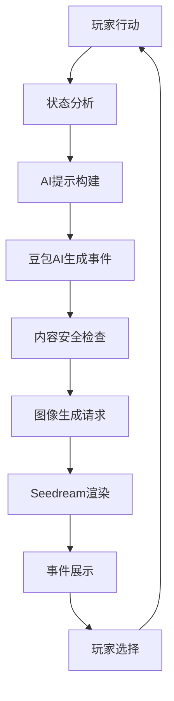

# 🤖 AI 人生重开·纯智能版

> 🚀 **开源创新**: 全球首个完全由 AI 驱动的纯前端人生模拟器，告别固定剧本，拥抱无限可能！

一个基于前沿 AI 技术的开源人生重开模拟游戏，集成豆包AI 和 Seedream 图像生成，提供**完全个性化**的图文互动体验。每一次重开都是独一无二的人生故事！

[](https://opensource.org/licenses/MIT)
[](https://vuejs.org/)
[](https://www.typescriptlang.org/)
[](https://console.volcengine.com/ark)
[](https://github.com/)

## ✨ 核心创新

### 🧠 纯 AI 驱动事件系统
- **零预设剧本**: 完全摆脱传统固定事件库，所有事件由 AI 实时生成
- **无限事件生成**: 基于豆包AI 模型，每次生成都是独一无二的人生体验
- **深度个性化**: 基于玩家属性、年龄、性格、历史经历动态生成事件
- **智能避重**: 自动分析历史事件，避免重复，确保每次都有新鲜感
- **年龄适配**: 根据玩家年龄阶段自动调整事件类型和复杂度

### 🎨 智能图像生成
- **Seedream 集成**: 为每个事件生成专属配图，增强沉浸感
- **角色一致性**: 智能保持角色外观连贯性，发型、肤色、脸型等特征稳定
- **场景适配**: 根据事件内容动态调整画面风格和场景元素
- **局部编辑优先**: 优先使用编辑模式，仅修改场景/道具/光线，保持角色主体不变
- **实时渲染**: 边玩边生成，沉浸式视觉体验

### 🛡️ 纯前端架构
- **无服务器**: 100% 前端实现，无需后端部署
- **隐私保护**: 所有数据本地存储，绝不上传
- **跨域解决**: 内置代理配置，解决 CORS 问题
- **离线支持**: 支持纯文本模式离线游戏

## 🎮 游戏特色

| 传统人生模拟器 | AI 人生重开 |
|---------------|-------------|
| 📚 固定剧本 (有限) | 🤖 AI 生成 (无限) |
| 🔄 重复体验 | ✨ 每次独特 |
| 📊 静态属性 | 🧠 智能适配 |
| 🖼️ 固定图片 | 🎨 实时生成 |
| 👥 千人一面 | 🎯 千人千面 |

## 🚀 快速开始

### 环境要求
- Node.js 18+
- 现代浏览器 (Chrome 90+, Firefox 88+, Safari 14+)

### 一键启动
```bash
# 1. 克隆项目
git clone https://github.com/chnjames/life-restart-ai.git
cd life-restart-ai

# 2. 安装依赖
npm install

# 3. 启动开发服务器
npm run dev

# 4. 打开浏览器访问 http://localhost:3000
```

### API 配置
在游戏设置中配置以下 API 密钥：

#### 豆包AI API (必需)
```bash
# 获取地址: https://console.volcengine.com/ark
DOUBAO_API_KEY=your-ark-api-key-here
DOUBAO_BASE_URL=https://ark.cn-beijing.volces.com/api/v3  # 可选，支持代理
```

#### Seedream API (可选，用于图像生成)
```bash
# 获取地址: https://www.volcengine.com/product/doubao
SEEDREAM_API_KEY=your-seedream-key-here
SEEDREAM_BASE_URL=https://ark.cn-beijing.volces.com
```

## 🏗️ 技术架构

### 核心技术栈
```
🎨 前端框架: Vue 3 + Composition API
📝 开发语言: TypeScript 5.x
🗃️ 状态管理: Pinia
🎯 路由系统: Vue Router 4
💅 样式框架: Tailwind CSS
⚡ 构建工具: Vite 5
🤖 AI 服务: 豆包AI + Seedream
```

### 项目结构
```
src/
├── 🎮 components/           # 游戏组件
│   ├── StatsPanel.vue         # 属性面板
│   ├── EventCard.vue          # 事件卡片
│   ├── CharacterCreator.vue   # 角色创建
│   └── ImageGenerator.vue     # 图像生成器
├── 📱 views/               # 页面视图
│   ├── HomeView.vue           # 游戏首页
│   ├── GameView.vue           # 主游戏界面
│   └── SettingsView.vue       # 设置中心
├── 🗄️ stores/              # 状态管理
│   ├── game.ts                # 游戏状态
│   ├── settings.ts            # 用户设置
│   └── events.ts              # 🌟 纯AI事件系统
├── 🔧 services/            # 核心服务
│   ├── doubao.ts              # 豆包AI 集成
│   ├── seedream.ts            # Seedream 集成
│   └── gameEngine.ts          # 游戏引擎
├── 📋 types/               # 类型定义
│   └── game.ts                # 游戏类型
└── 🛠️ utils/               # 工具函数
    ├── imageGeneration.ts     # 图像生成策略
    └── safety.ts              # 安全检查系统
```

## 🧠 AI 系统详解

### 智能事件生成流程


### 核心数据结构
```typescript
// 🎯 AI 生成的游戏事件
interface AIGeneratedEvent {
  title: string              // 事件标题
  description: string        // 详细描述
  choices: Choice[]          // 选择选项
  tags: string[]            // 事件标签
  ageAppropriate: boolean   // 年龄适宜性
  visualPrompt: string      // 图像生成提示
}

// 📊 玩家状态分析
interface PlayerAnalysis {
  age: number               // 当前年龄
  stats: GameStats         // 属性数值
  personality: string[]    // 性格标签
  lifeContext: string     // 生活背景
  recentEvents: string[]  // 近期事件（避重用）
}

// 🎨 图像生成配置
interface ImageGeneration {
  prompt: string           // 生成提示
  style: ArtStyle         // 艺术风格
  character: Character    // 角色信息
  scene: SceneConfig     // 场景配置
}
```

## 🎯 使用指南

### 1. 角色创建
```
👤 基础信息: 姓名、性别、出生年份
🎨 外观设计: 发型、脸型、服装风格
📊 属性分配: 智力、体质、魅力、运气 (总计20点)
🎭 性格设定: 选择3-5个性格标签
```

### 2. 游戏进行
```
📖 阅读AI生成的事件描述
🖼️ 欣赏专属配图
🤔 分析各选项的潜在影响
✅ 做出人生选择
📈 观察属性和状态变化
🔄 继续下一个人生阶段
```

### 3. 高级功能
```
💾 存档管理: 支持多个存档槽位
📊 数据统计: 详细的人生轨迹分析
🎨 图像收藏: 保存喜欢的AI生成图片
⚙️ 个性化设置: 调整AI生成偏好
```

## 🔧 开发指南

### 本地开发
```bash
# 🔧 开发模式
npm run dev

# 🏗️ 生产构建
npm run build

# 🧪 类型检查
npm run type-check

# 💅 代码格式化
npm run format

# 🧹 代码检查
npm run lint
```

### 自定义 AI 行为
```typescript
// 📝 修改 AI 提示词模板
// 文件: src/services/doubao.ts
const buildEventPrompt = (playerState: PlayerState) => {
  return `
    你是一个专业的人生模拟器AI，请为以下玩家生成一个个性化的人生事件：
    
    玩家信息：
    - 年龄：${playerState.age}岁
    - 性格：${playerState.personality.join(', ')}
    - 当前状态：${playerState.currentSituation}
    
    要求：
    1. 事件要符合玩家年龄和性格
    2. 提供2-4个有意义的选择
    3. 确保内容积极向上
    4. 输出标准JSON格式
  `
}
```

### 添加新功能
```typescript
// 🎮 扩展游戏机制
// 文件: src/stores/game.ts
export const useGameStore = defineStore('game', () => {
  // 添加新的游戏状态
  const customFeature = ref<CustomFeature>({
    enabled: false,
    config: {}
  })
  
  // 添加新的游戏逻辑
  const handleCustomEvent = async (eventData: CustomEventData) => {
    // 自定义事件处理逻辑
  }
  
  return {
    customFeature,
    handleCustomEvent
  }
})
```

## 🚀 部署指南

### GitHub Pages 部署
```bash
# 1. 构建项目
npm run build

# 2. 部署到 gh-pages 分支
npm run deploy
```

## 🔒 安全与隐私

### 数据安全
- ✅ **本地存储**: 所有游戏数据存储在浏览器本地
- ✅ **零服务器**: 纯前端应用，无后端数据收集
- ✅ **API安全**: 支持自定义API端点和代理
- ✅ **内容过滤**: 多层AI内容安全检查

### 隐私保护
- 🔐 API密钥本地加密存储
- 🚫 不收集任何个人信息
- 🔄 支持完全离线模式（文本版）
- 🗑️ 一键清除所有本地数据

## 🤝 贡献指南

我们欢迎所有形式的贡献！

### 贡献方式
- 🐛 **报告Bug**: 提交详细的问题描述
- 💡 **功能建议**: 分享你的创意想法
- 📝 **代码贡献**: 提交Pull Request
- 📚 **文档改进**: 完善项目文档
- 🌍 **国际化**: 添加多语言支持

### 开发流程
```bash
# 1. Fork 项目
git fork https://github.com/chnjames/life-restart-ai.git

# 2. 创建功能分支
git checkout -b feature/amazing-feature

# 3. 提交更改
git commit -m 'Add some amazing feature'

# 4. 推送分支
git push origin feature/amazing-feature

# 5. 创建 Pull Request
```

## 📊 项目统计

- 🎯 **事件无限性**: ∞ (AI生成)
- 🎨 **图像多样性**: 每次独特
- 🔒 **安全等级**: 企业级
- 🌍 **浏览器支持**: 95%+
- ⚡ **响应速度**: <3秒
- 💾 **存储占用**: <10MB

## 🏆 技术亮点

### 🚀 性能优化
- **懒加载**: 组件按需加载
- **缓存策略**: 智能API响应缓存
- **图像优化**: WebP格式支持
- **代码分割**: 自动代码分块

### 🎨 用户体验
- **响应式设计**: 完美适配各种设备
- **暗黑模式**: 护眼夜间模式
- **动画效果**: 流畅的过渡动画
- **无障碍**: WCAG 2.1 AA级支持

### 🔧 开发体验
- **TypeScript**: 完整类型安全
- **热重载**: 开发时实时更新
- **ESLint**: 代码质量保证
- **Prettier**: 统一代码风格

## 🔮 未来展望

### 🎯 短期目标 (3-6个月)

#### 🤖 AI 能力增强
- **多模型支持**: 集成 Claude、Gemini 等模型
- **本地 AI**: 支持 Ollama 等本地大模型
- **智能记忆**: AI 记住玩家偏好和历史
- **情感分析**: 根据玩家情绪调整事件生成

#### 🎨 视觉体验升级
- **更多风格**: 支持油画、水彩、像素等艺术风格
- **角色编辑**: 更丰富的角色自定义选项
- **场景多样性**: 更多样化的背景和环境
- **图像质量**: 支持更高分辨率的图像生成

#### 🎮 游戏机制创新
- **成就系统**: 丰富的里程碑和收集要素
- **数据可视化**: 人生轨迹的图表化展示
- **多线程剧情**: 支持平行宇宙和时间线分支
- **自定义事件**: 允许玩家创建和分享事件

### 🌟 长期愿景 (1-2年)

#### 🧠 AI 技术前沿
- **多模态交互**: 语音、图像、文本的全方位交互
- **情感计算**: AI 具备更真实的情感理解
- **创意协作**: AI 成为真正的创作伙伴
- **个性化引擎**: 深度学习用户偏好

#### 🌐 开源生态
- **插件市场**: 丰富的第三方扩展生态
- **开发者工具**: 完善的开发和调试工具
- **API 开放**: 为其他开发者提供 AI 能力
- **社区治理**: 建立健康的开源社区

## 🌍 社会价值

### 🎓 教育意义
- **人生规划**: 帮助年轻人思考人生选择
- **决策训练**: 培养批判性思维能力
- **同理心培养**: 通过不同角色体验增进理解
- **压力释放**: 提供安全的人生试错空间

### 🧠 心理健康
- **焦虑缓解**: 通过虚拟体验减少对未来的恐惧
- **自我探索**: 帮助用户发现真实的内心需求
- **情感支持**: AI 伙伴提供情感陪伴
- **治疗辅助**: 为心理咨询提供新的工具

### 🌐 技术贡献
- **AI 应用**: 在游戏领域的创新实践
- **开源精神**: 为社区提供高质量的开源项目
- **技术普及**: 降低 AI 技术的使用门槛
- **知识分享**: 通过开源推动技术进步

## 🔬 技术研究

### 🧠 AI 技术探索
- **提示工程**: 优化 AI 生成内容的质量
- **个性化算法**: 提升 AI 对用户偏好的理解
- **内容安全**: 研究更有效的内容过滤机制
- **性能优化**: 减少 AI API 调用成本和延迟

### 🎮 游戏科学
- **沉浸理论**: 如何创造更深层的沉浸体验
- **选择心理学**: 玩家决策行为的科学分析
- **虚拟身份**: 数字化身份对现实自我的影响
- **游戏化设计**: 如何让学习和成长更有趣

### 🌐 开源实践
- **社区建设**: 如何构建健康的开源社区
- **协作模式**: 探索更有效的开源协作方式
- **可持续发展**: 开源项目的长期维护策略
- **影响力评估**: 衡量开源项目的社会价值

## 📚 学习资源

### 📖 推荐阅读
- **《Vue.js 设计与实现》**: Vue 3 深度解析
- **《TypeScript 编程》**: TypeScript 最佳实践
- **《人工智能：一种现代方法》**: AI 基础理论
- **《游戏设计艺术》**: 游戏设计经典教材

### 🎓 在线课程
- **Vue 3 官方文档**: 最权威的学习资源
- **TypeScript 官方手册**: 类型系统详解
- **豆包AI API 文档**: AI 接口使用指南
- **MDN Web 文档**: Web 技术标准参考

### 🛠️ 开发工具
- **VS Code**: 推荐的代码编辑器
- **Vue DevTools**: Vue 应用调试工具
- **Postman**: API 测试工具
- **Figma**: UI/UX 设计工具

## 📞 联系我们

- 🐛 **问题反馈**: [GitHub Issues](https://github.com/chnjames/life-restart-ai/issues)
- 📧 **邮箱联系**: [chnrural910@gmail.com](mailto:chnrural910@gmail.com)
- 🌟 **关注项目**: 给我们一个 Star 支持开源！

## 📄 许可证

本项目采用 [MIT License](LICENSE) 开源协议。

---

<div align="center">

**🌟 如果这个项目对你有帮助，请给我们一个 Star！🌟**

Made with ❤️ by Open Source Community

[⬆️ 回到顶部](#-ai-人生重开纯智能版)

</div>
